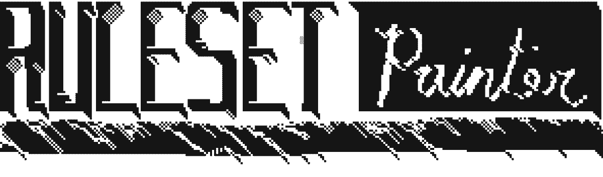
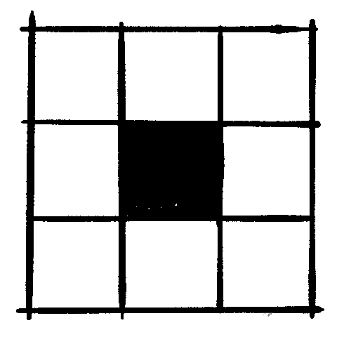
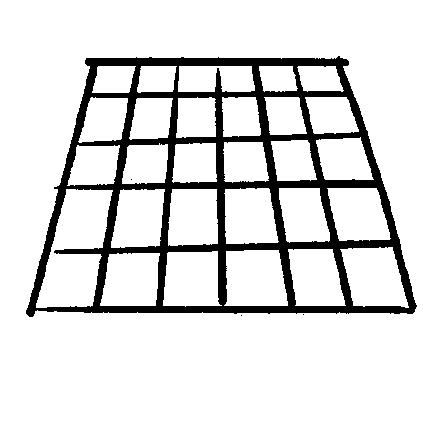

# Ruleset Painting Tool

The _Ruleset Painting Tool_ exists as an accessible method of exploring the way decentralized systems interact and compound. Specifically, this tool allows the user to design and arrange different [cellular automata](https://en.wikipedia.org/wiki/Cellular_automaton) — systems of computation where a group of entities each follow simple rules, but collectively exhibit complex behavior. The interface aims to create a real-time environment for playing/editing/drawing with these simple systems in the browser.

## How It Works
============

###### CANVAS

#### The canvas consists of a 2D grid of cells.

###### CELL STATE

#### Each cell is assigned a binary value: _BLACK_ or _WHITE_.

*   Values can be "painted" by the user.

###### GENERATION

#### Every cell checks it's surrounding neigborhood against a ruleset to determine if it will change state.

*   Rulesets are applied at each time step.
*   Rulesets are set by the user.
*   Cells may have different rulesets.

###### PARALLEL

#### Every cell’s ruleset is applied concurrently across the grid.

*   Evaluating one cell's ruleset will not effect its neighbor within the same generation cycle.

References and Other Projects
==========

- [ColorCode](http://colorcode2.bananabanana.me/)
- [SplatyCode](http://splatycode.bananabanana.me/)
- [Logic Grid](https://sciencevsmagic.net/logicgrid/#382C42)
- [Turtles, Termites, and Traffic Jams](https://mitpress.mit.edu/9780262680936/turtles-termites-and-traffic-jams/)
- [Two-Dimensional Cellular Automata](https://www.are.na/block/21728930)
- [Cellular Automata-Based Generative Textile Design](http://www.ijdesign.org/index.php/IJDesign/article/viewFile/3050/825)
